# Torio-Client
A lightweight Ghost Client for **Minecraft Bedrock Edition**  
**Stable Version: 1.21.130 ～ v26.13**

[![downloads][16]][17]

[16]: https://custom-icon-badges.demolab.com/badge/-Download-F25278?logo=download&logoColor=white
[17]: https://github.com/Uncle-Awrt/Torio-Client/releases/download/v2.0.0-beta.2/TorioClient.exe

Torio-Client is designed to enhance gameplay with visual tools, movement utilities, and customizable modules.  
All features are fully toggleable and optimized for smooth performance.

> ⚠️ As of v1.2.0-beta.1, Torio-Client has been migrated from **Python 3.11** to **WPF (C#)** for significantly improved performance and launch speed.

## 🔗 Source Code (C# / WPF)
https://github.com/kukentyan/torio-master-wpf

> Note: The source code is not yet available as a stable version has not been released.

## 📢 Discord
For announcements, support, and feedback, join our official Discord server:  
**If you are having an issue, DO NOT open an issue on this repo.**  
Instead, please join our Discord server for support:

**https://discord.gg/xq8sWQhuXG**

---

## Features

### Visual Modules

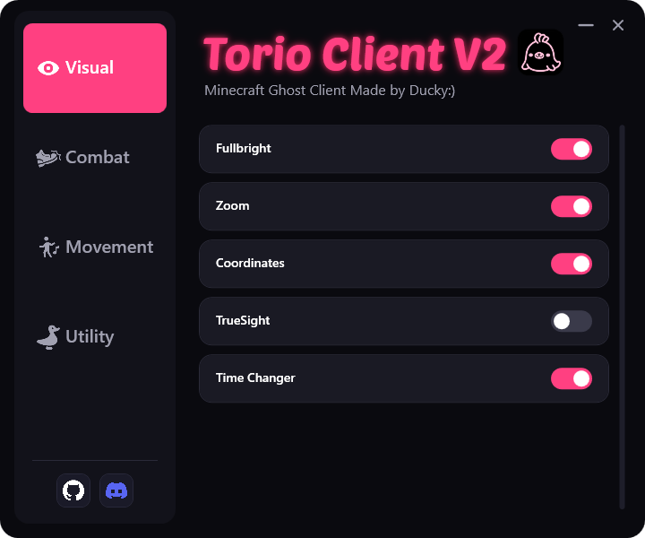

#### FullBright
Keeps the world fully illuminated at all times.

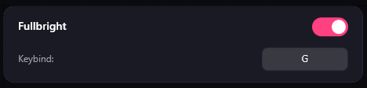

#### Zoom
Adjustable zoom for clearer long-distance vision.

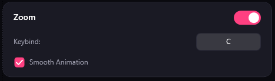

#### Coordinates
Displays your current XYZ coordinates on screen.

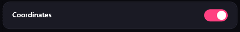

#### TrueSight
Makes all invisible entities fully visible (e.g. invisible players, mobs, or effects).

#### TimeChanger
Freely change the in-game time client-side for better visibility or aesthetics.

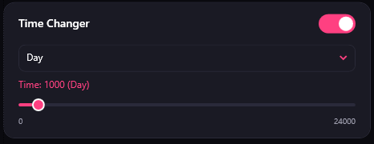

#### No Hurt Cam (1.21.130 ~ 1.21.132 only)
Disables the hurt camera shake effect when taking damage.

---

### Combat Modules

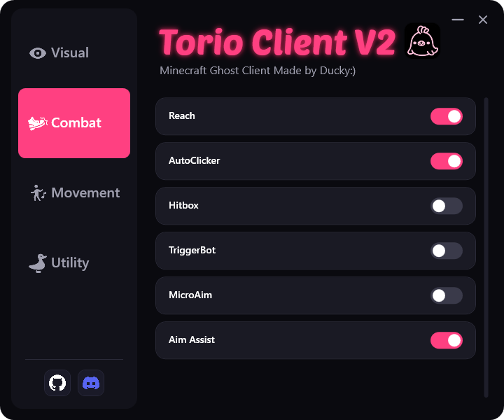

#### Reach (Randomizer Support)
Extends melee attack distance.

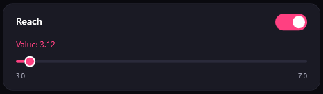

#### AutoClicker (Left & Right) (Randomizer Support)
Automates left and right clicks. Menu Check and Block Break Check can now be toggled individually via checkboxes.

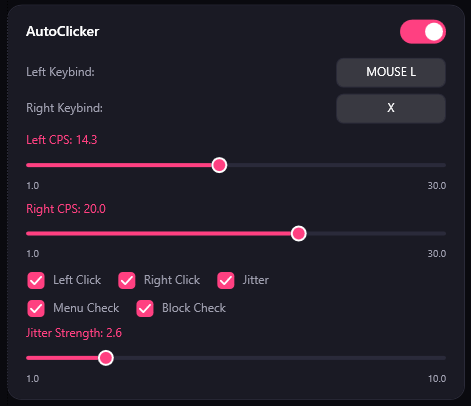

#### Hitbox
Expands entity hitboxes for easier targeting.

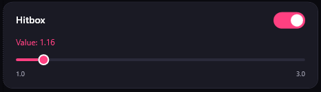

#### Trigger Bot (CPS Randomizer Support)
Automatically attacks when your crosshair is over a target. Supports **First Hit**, **Auto Click**, and the new **HitSelect** mode (activates when you are hit by an opponent while already aiming at them).

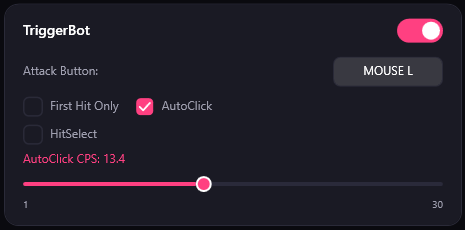

#### Micro Aim (Randomizer Support)
Automatically fine-tunes your sensitivity when manually aiming at an enemy, helping your aim lock on smoothly.

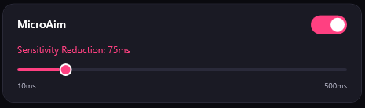

#### Aim Assist
Guides your aim toward nearby targets. Local player is excluded to prevent self-targeting. Aim movement is smooth and no longer jittery.

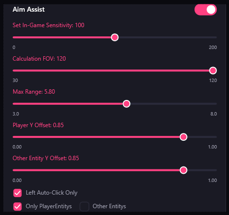

---

### Movement Modules

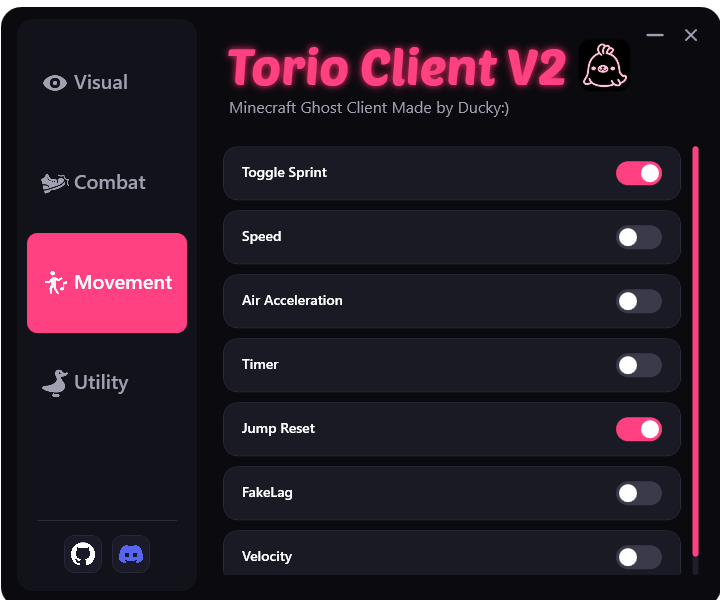

#### ToggleSprint
Sprint without holding the sprint key.

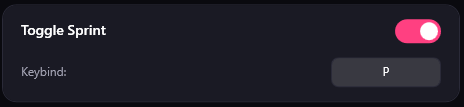

#### Speed (Randomizer Support)
Increases player movement speed.

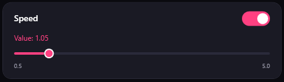

#### Air Acceleration (Randomizer Support)
Allows you to modify acceleration while jumping.

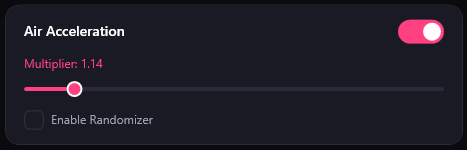

#### Timer (Randomizer Support)
Allows you to modify the game's tick speed.

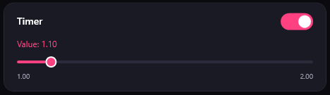

#### JumpReset (Randomizer Support)
Automates jump reset timing during combat. (Currently in testing – may be unstable.)

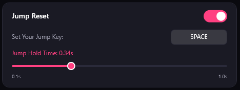

#### FakeLag
Hold the configured keybind to freeze ticks and simulate lag.

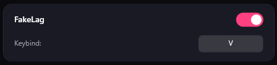

#### Velocity
Reduces or prevents knockback from attacks.

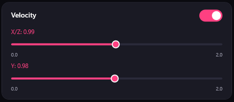

---

### Utility

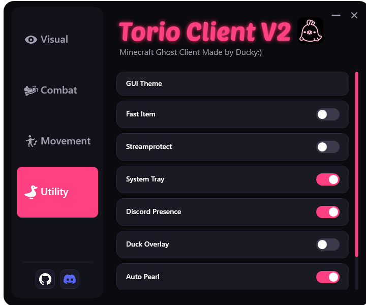

#### GUI Theme
Customize the look of Torio-Client with full RGB color balance control. Includes a Night Mode and the ability to reset back to the default colors at any time.

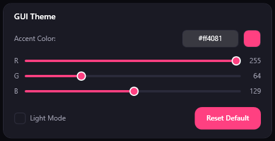

#### Fast Item
Speeds up item use timers, allowing faster item usage.

#### Stream Protect
Hides sensitive or personal information while streaming.

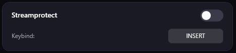

#### SystemTray
Minimize Torio-Client to the system tray and reopen it at any time.

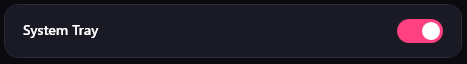

#### Discord Presence (Experimental – Contains Known Bugs)
Displays your current menu, server, Minecraft version, and client status on Discord.

  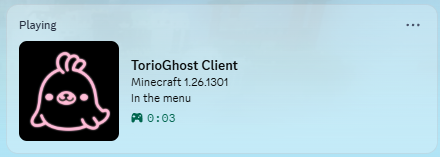
  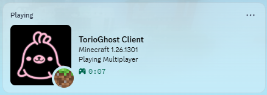
  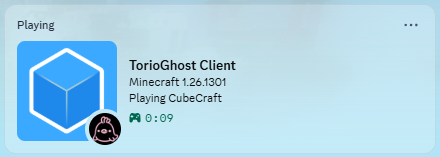

#### Duck Overlay
Displays a cute duck GIF on your screen to help you stay calm during gameplay.

#### Auto Pearl *(Macro)*
Automated pearl throwing macro.

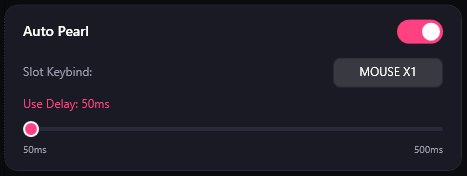

#### AutoBow *(Macro)*
Automated bow macro.

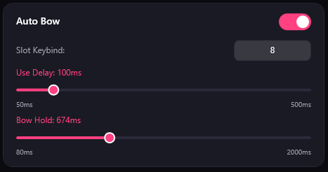

---

### Animations
- **Expandable Module Cards** – Each module can be expanded to reveal its settings and options with a smooth animation.
- **Toggle Switches** – Modules are enabled and disabled with a smooth toggle switch animation.

---

## Customization

### ⌨️ Keybind Customization
Most modules support customizable keybinds, allowing you to assign controls that fit your playstyle.

### 💾 Config System
Save, load, and manage your personalized configurations. Useful for switching between setups quickly or backing up your settings.

---

---

# 📦 Archive — Python Version (up to v1.1.0-beta.3)

> The following section is preserved for reference. The Python-based version of Torio-Client is no longer maintained.  
> Last Python release: [v1.1.0-beta.3](https://github.com/Uncle-Awrt/Torio-Client/releases/tag/v1.1.0-beta.3)

## 🔗 Source Code (Python)
https://github.com/kukentyan/torio-master

## Features (Python Version)

### Player Modules
- **Fast Item** – Speeds up item use timers, allowing faster item usage.

### Visual Modules
- **FullBright** – Keeps the world fully illuminated at all times.
- **Zoom** – Adjustable zoom for clearer long-distance vision.
- **Coordinates** – Displays your current XYZ coordinates on screen.
- **No Hurt Cam** – Disables the hurt camera shake effect when taking damage. (1.21.130~1.21.132 Only)
- **TrueSight** – Makes all invisible entities fully visible.
- **TimeChanger** – Allows you to freely change the in-game time client-side.

### Combat Modules
- **Reach** – Extends melee attack distance.
- **AutoClicker (Left & Right)** – Automates left and right clicks for combat and building.
- **Hitbox** – Expands entity hitboxes for easier targeting.
- **Micro Aim** – Automatically fine-tunes your sensitivity when manually aiming at an enemy.
- **Trigger Bot** – Automatically attacks when your crosshair is over a target. Supports two modes: First Hit and Auto Click.
- **Aim Assist** – Helps guide your aim toward newly targets.

### Movement Modules
- **ToggleSprint** – Sprint without holding the sprint key.
- **Speed** – Increases player movement speed.
- **JumpReset** *(Test Module)* – Automates jump reset timing during combat. (Supports 1.21.132 and v26)
- **AntiKnockback** – Reduces or prevents knockback from attacks.

### Misc Modules
- **Stream Protect** – Hides sensitive or personal information while streaming.
- **SystemTray** – Open the Torio-Client window from the system tray or exit the client.

---

# ⚠️ Disclaimer
Use of this software is at your **own risk**.  
By using Torio-Client, you agree that all actions are taken at your **own risk**.  
The developer is **not responsible** for any issues, penalties, or data loss caused by using this software.  
Please use responsibly and understand the risks before running the program.

---

## 📄 License
This project is licensed under the [Attribution-NonCommercial 4.0 International (CC BY-NC 4.0)](https://github.com/Uncle-Awrt/Torio-Client/blob/main/LICENSE).  
You may share and adapt this project for non-commercial purposes, as long as appropriate credit is given.
