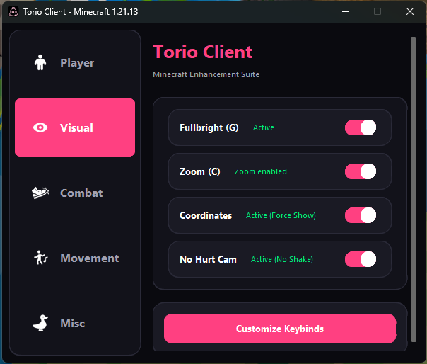
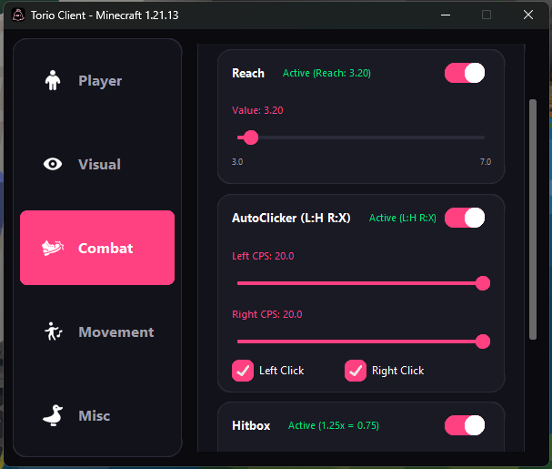
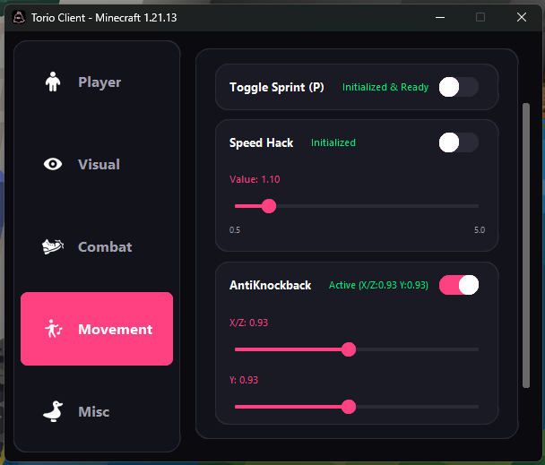
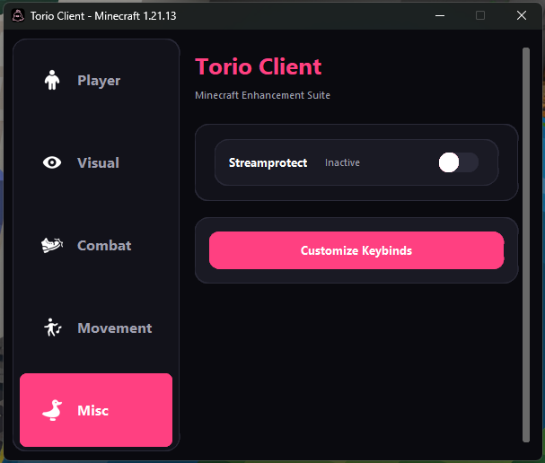
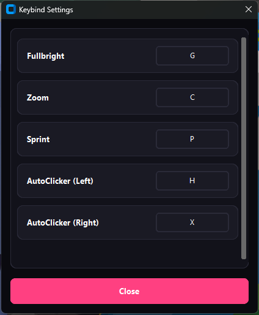

# Torio-Client
A lightweight Ghost Client for **Minecraft Bedrock Edition**  
**Stable Version: 1.21.120 ～ 1.21.131**

[![downloads][16]][17]

[16]: https://custom-icon-badges.demolab.com/badge/-Download-F25278?logo=download&logoColor=white
[17]: https://github.com/Uncle-Awrt/Torio-Client/releases/download/v1.0.3/TorioClient.exe

Torio-Client is designed to enhance gameplay with visual tools, movement utilities, and customizable modules.  
All features are fully toggleable and optimized for smooth performance.

## 📢 Discord
For announcements, support, and feedback, join our official Discord server:
**If you are having an issue, DO NOT open an issue on this repo.**  
Instead, please join our Discord server for support: 

**https://discord.gg/xq8sWQhuXG**

---

## Features

### Visual Modules
- **FullBright** – Keeps the world fully illuminated at all times.
- **Zoom** – Adjustable zoom for clearer long-distance vision.
- **Coordinates** – Displays your current XYZ coordinates on screen.

---

### Combat Modules
- **Reach** – Extends melee attack distance.
- **AutoClicker (Left & Right)** – Automates left and right clicks for combat and building.
- **Hitbox** – Expands entity hitboxes for easier targeting.

---

### Movement Modules
- **ToggleSprint** – Sprint without holding the sprint key.
- **Speed** – Increases player movement speed.
- **AntiKnockback** – Reduces or prevents knockback from attacks.(Just on Servers)

---

### Misc Modules
- **Stream Protect** – Hides sensitive or personal information while streaming.

---

### Player Modules (Coming Soon)

---

## Customization

### **Keybind Customization**
Most modules support customizable keybinds, allowing you to assign controls that fit your playstyle.  
(Some modules do not support keybinds.)

---

### **Config System**
Save, load, and manage your personalized configurations.  
Useful for switching between setups quickly or backing up your settings.

---

# ⚠️ Use of this software is at your **own risk**.
By using Torio-Client, you agree that all actions are taken at your **own risk**.  
The developer is **not responsible** for any issues, penalties, or data loss caused by using this software.  
Please use responsibly and understand the risks before running the program.
