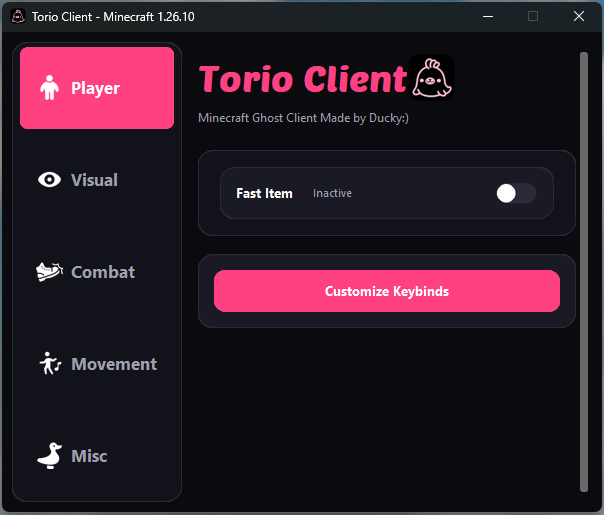
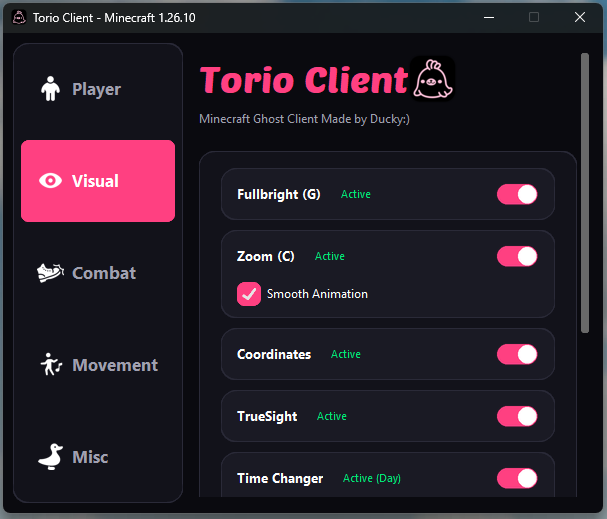
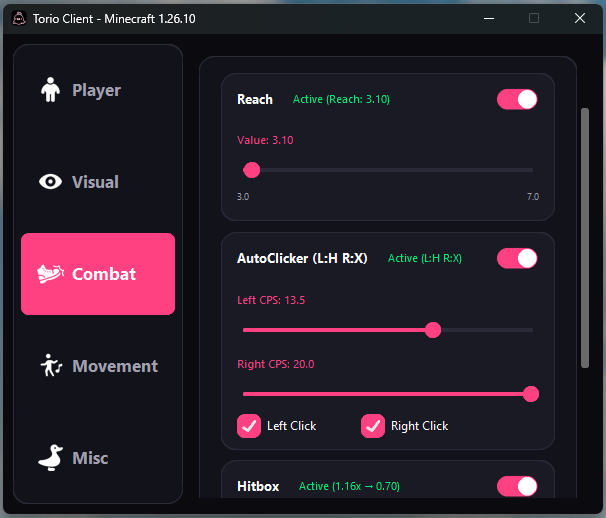
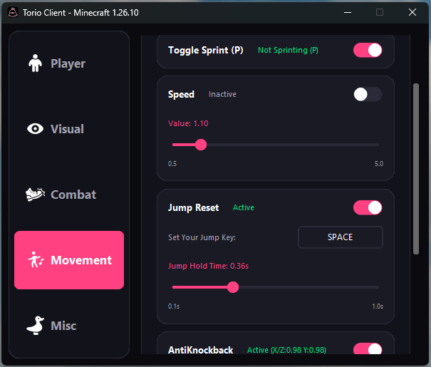
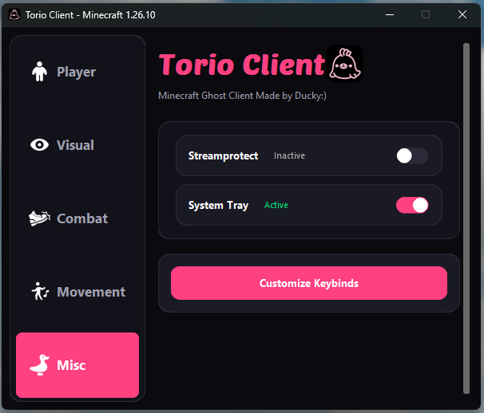
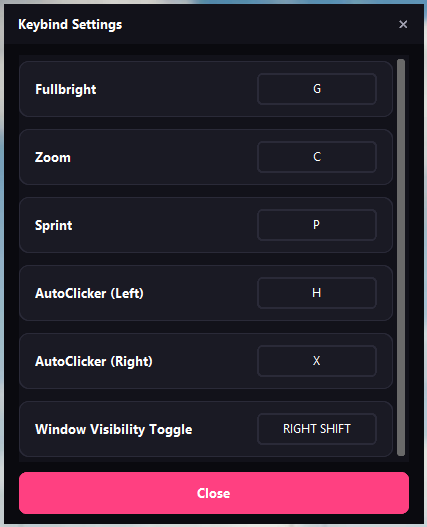

# Torio-Client
A lightweight Ghost Client for **Minecraft Bedrock Edition**  
**Stable Version: 1.21.130 ～ v26.3**

[![downloads][16]][17]

[16]: https://custom-icon-badges.demolab.com/badge/-Download-F25278?logo=download&logoColor=white
[17]: https://github.com/Uncle-Awrt/Torio-Client/releases/download/v1.0.9/TorioClient.exe

Torio-Client is designed to enhance gameplay with visual tools, movement utilities, and customizable modules.  
All features are fully toggleable and optimized for smooth performance.
## source code(The Client is made with python)
https://github.com/kukentyan/torio-master

## 📢 Discord
For announcements, support, and feedback, join our official Discord server:
**If you are having an issue, DO NOT open an issue on this repo.**  
Instead, please join our Discord server for support: 

**https://discord.gg/xq8sWQhuXG**

---

## Features

### Player Modules
- **Fast Item** – Speeds up item use timers, allowing faster item usage.

### Visual Modules
- **FullBright** – Keeps the world fully illuminated at all times.
- **Zoom** – Adjustable zoom for clearer long-distance vision.
- **Coordinates** – Displays your current XYZ coordinates on screen.
- **No Hurt Cam** – Disables the hurt camera shake effect when taking damage.(1.21.130~1.21.132 Only)
- **TrueSight** – Makes all invisible entities fully visible (e.g. invisible players, mobs, or effects).
- **TimeChanger** – Allows you to freely change the in-game time client-side for better visibility or aesthetics.

---

### Combat Modules
- **Reach** – Extends melee attack distance.
- **AutoClicker (Left & Right)** – Automates left and right clicks for combat and building.
- **Hitbox** – Expands entity hitboxes for easier targeting.
- **Micro Aim** – Automatically fine-tunes your sensitivity when manually aiming at an enemy, helping your aim lock on smoothly.
- **Trigger Bot** – Automatically attacks when your crosshair is over a target. Supports two switchable modes: First Hit and Auto Click.
- **Aim Assist** – Helps guide your aim toward nearby targets by subtly adjusting your crosshair. Improves tracking and target focus, but may feel inconsistent in its current state (will be refined in the next update).

---

### Movement Modules
- **ToggleSprint** – Sprint without holding the sprint key.
- **Speed** – Increases player movement speed.
- **JumpReset(Test Module)** – Automates jump reset timing during combat. (Supports 1.21.132 and v26 - Currently in testing – may be unstable or not work as intended.)
- **AntiKnockback** – Reduces or prevents knockback from attacks.

---

### Misc Modules
- **Stream Protect** – Hides sensitive or personal information while streaming.
- **SystemTray** – Open the Torio-Client window from the system tray or exit the client.

---

## Customization

### **Keybind Customization**
Most modules support customizable keybinds, allowing you to assign controls that fit your playstyle.  
(Some modules do not support keybinds.)

---

### **Config System**
Save, load, and manage your personalized configurations.  
Useful for switching between setups quickly or backing up your settings.

---

# ⚠️ Use of this software is at your **own risk**.
By using Torio-Client, you agree that all actions are taken at your **own risk**.  
The developer is **not responsible** for any issues, penalties, or data loss caused by using this software.  
Please use responsibly and understand the risks before running the program.
